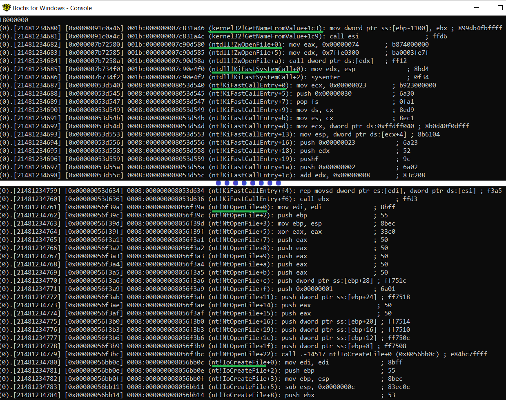
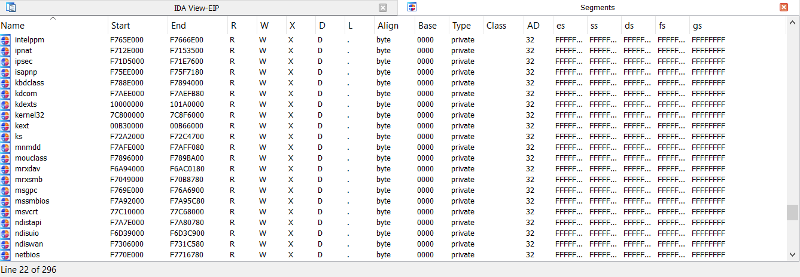

# symseghelper
Helper scripts for windows debugging with symbols for Bochs and IDA Pro (PDB files). Very handy for user mode <--> kernel mode


# Fast and easy way (only names)

In Guest: Install windows debugging tools (windbg)

In Guest: install debug symbols

In Guest: execute windbg with command line -logo:
```
"C:\Program Files\Debugging Tools for Windows (x86)\windbg.exe" -logo c:\windbg_syms_output.txt
```

Go to File -> Kernel Debug -> Local

Go to File -> Symbol File Path -> Browse 

Select your symbol path (for me its C:\winsymbols), Select Reload -> OK

List all processes in windbg with:
```
!process 0 0 

...

PROCESS 8982ec20  SessionId: 0  Cid: 056c    Peb: 7ffd7000  ParentCid: 0548
    DirBase: 10a83000  ObjectTable: e18f4320  HandleCount: 237.
    Image: explorer.exe

...
```

Attach to explorer.exe with **.process /p /r** 8976e2d0 (it has a a lot of user mode dlls)
```
.process /p /r 8982ec20
```

type: 
```
.reload -a
```

type:
```
.reload /f
```

Execute in windbg:
```
x /2 *!*
```

Wait and be patient

Close windbg

Clean c:\windbg_syms_output.txt file, removing all lines before
```
lkd> x /2 *!*
```

windbg_syms_output.txt should looks like:

```
7ffe0300 SharedUserData!SystemCallStub
00af1d80 kext!diskspace
00af2af0 kext!DebugExtensionInitialize
00af2bb0 kext!DebugExtensionNotify
00af2ce0 kext!DebugExtensionUninitialize
...
f7ba0a90 Ntfs!LfsAllocateSpanningBuffer
f7b78831 Ntfs!NtfsQueryBasicInfo
f7b85653 Ntfs!NtfsCacheSharedSecurityByDescriptor
```

Move windbg_syms_output.txt to Host

In Host: Execute
```
windbg_syms_parser.py windbg_syms_output.txt bochs_syms_and_ida_names.txt
```

## Bochs

in Host: Open Bochs Debugger, start a debug session, Press Ctrl + C (break). Use ldsym global bochs_syms_and_ida_names.txt 

Example:
```
ldsym global "C:\\Users\\leno\\Desktop\\symseghelper\\bochs_syms_and_ida_names.txt"
```

Done!



## IDA PRO:

in Host: Open IDA PRO, start a debug session and go to File -> Script File 

Select ida_load_names.py, this script ask you for bochs_syms_and_ida_names.txt 

Done!


# Segments 

**WARNING:** Only follow these steps if you need segments

Copy dumpmodules.wds to Guest C:\

Create in Guest C:\outfiles directory

In Guest: Install windows debugging tools (windbg)

In Guest: install debug symbols

In Guest: execute windbg
```
"C:\Program Files\Debugging Tools for Windows (x86)\windbg.exe"
```

Go to File -> Kernel Debug -> Local

Go to File -> Symbol File Path -> Browse 

Select your symbol path (for me its C:\winsymbols), Select Reload -> OK

List all processes in windbg with:
```
!process 0 0 

...

PROCESS 8982ec20  SessionId: 0  Cid: 056c    Peb: 7ffd7000  ParentCid: 0548
    DirBase: 10a83000  ObjectTable: e18f4320  HandleCount: 237.
    Image: explorer.exe

...
```

Attach to explorer.exe with **.process /p /r** 8976e2d0 (it has a a lot of user mode dlls)
```
.process /p /r 8982ec20
```

type: 
```
.reload -a
```

type:
```
.reload /f
```

Execute in windbg
```
$$>a<C:\dumpmodules.wds C:\outfiles
```

move C:\outfiles dir from Guest to Host

type in windbg
```
.cls
```

type in windbg
```
lm vo
```

Create a new file called windbg_lm_output.txt and paste **lm vo** output

 windbg_lm_output.txt shoud looks like:
```
806d0000 806f0300   hal        (pdb symbols)          c:\winsymbols\dll\halaacpi.pdb
    Loaded symbol image file: halaacpi.dll
    Image path: halaacpi.dll
    Image name: halaacpi.dll
    Timestamp:        Sun Apr 13 11:31:27 2008 (4802517F)
    CheckSum:         00024F17
    ImageSize:        00020300
    Translations:     0000.04b0 0000.04e4 0409.04b0 0409.04e4
bf800000 bf9c2980   win32k     (pdb symbols)          c:\winsymbols\sys\win32k.pdb
    Loaded symbol image file: \SystemRoot\System32\win32k.sys
    Image path: \SystemRoot\System32\win32k.sys
...
```

move windbg_lm_output.txt to Guest

## In Host

with seg_helper.py, windbg_lm_output.txt and outfiles/ in same path, execute:
```
seg_helper.py windbg_lm_output.txt outfiles ida_segments.txt bochs_segments.txt
```

### bochs_segments.txt

you can use this file in Bochs debugger with ldsym global, example:

```
ldsym global "C:\\Users\\leno\\Desktop\\symseghelper\\bochs_segments.txt"
```

It can be useful have segments + symbols together:
```
type bochs_segments.txt > bochs_syms_with_segments.txt
type bochs_syms_and_ida_names.txt >> bochs_syms_with_segments.txt
```

Load segments + symbols in Bochs:
```
ldsym global "C:\\Users\\leno\\Desktop\\symseghelper\\bochs_syms_with_segments.txt"
```

Now, when a instruction its out of a known segment its easy to view:


### ida_segments.txt

in Host: Open IDA PRO, start a debug session and go to File -> Script File 

Select ida_load_segs.py, this script ask you for ida_segments.txt

done!



# Related

- https://github.com/therealdreg/pdbdump_bochs
- https://github.com/therealdreg/ida_bochs_windows
- https://github.com/therealdreg/ida_vmware_windows_gdb
- https://github.com/therealdreg/bochs_linux_kernel_debugging
